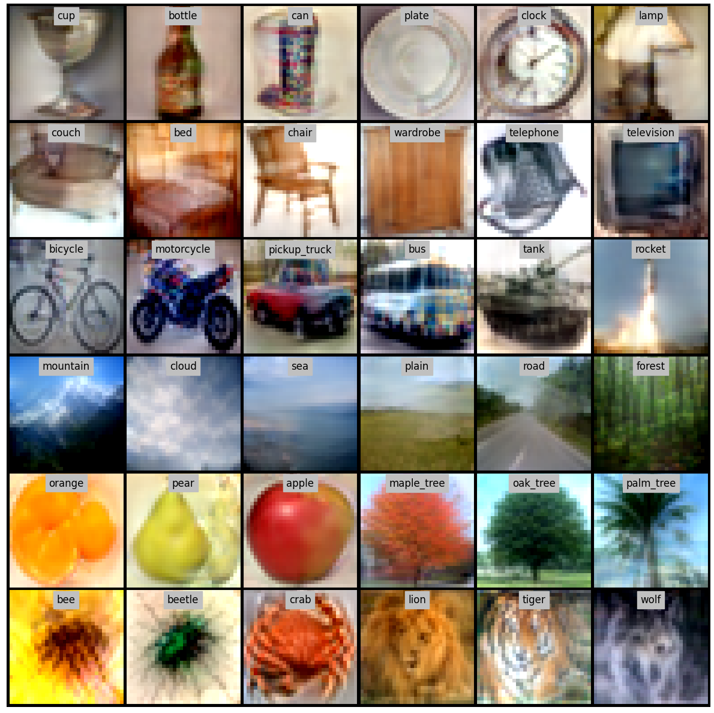
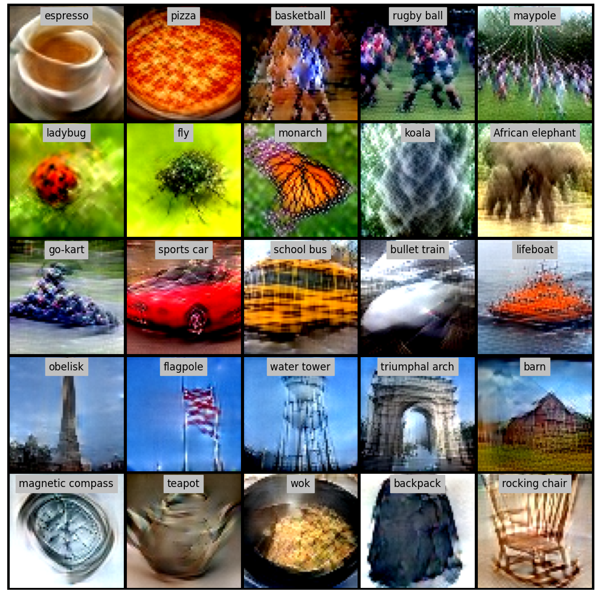
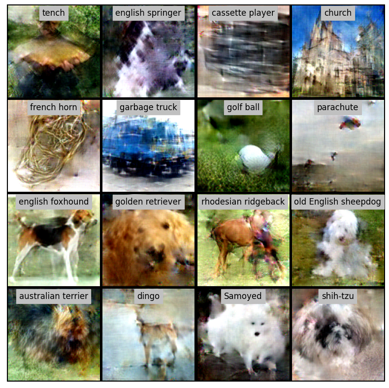
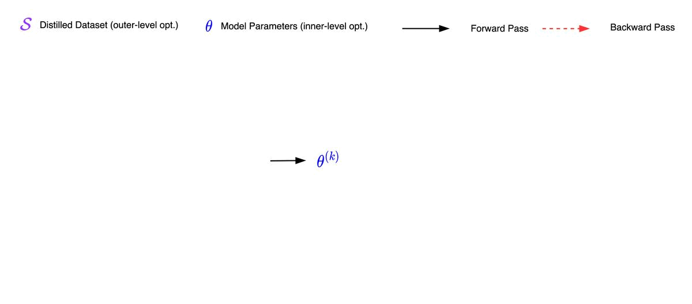
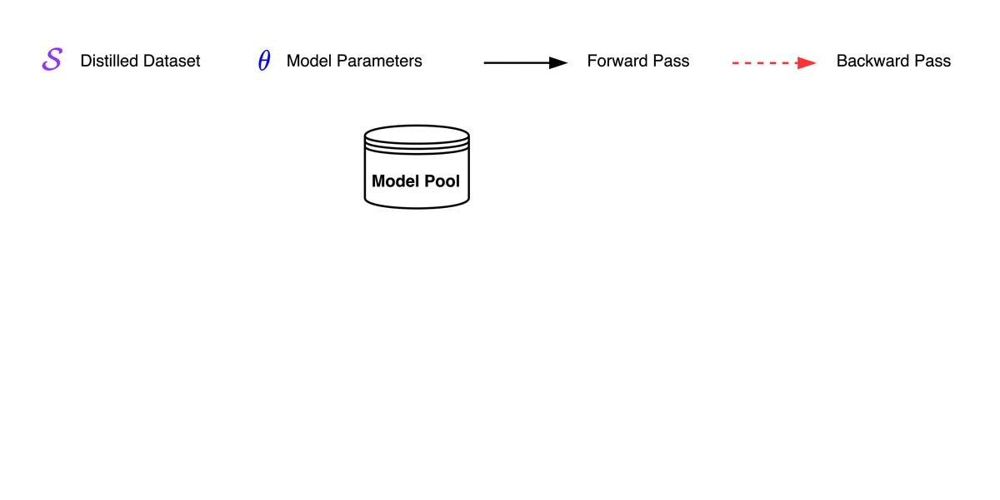

# Dataset Distillation using Neural Feature Regression (FRePo)

[Project Page](https://sites.google.com/view/frepo) | [OpenReview](https://openreview.net/forum?id=2clwrA2tfik)
| [ArXiv](https://arxiv.org/abs/2206.00719)
| [Video](https://recorder-v3.slideslive.com/#/share?share=75661&s=b6c2d107-2ff6-44a5-aadf-f2a600467abd)
| [Slides](https://docs.google.com/presentation/d/10NMtEVsW-nbEWgbTEJQYMH-rdgOklXZF/edit?usp=sharing&ouid=116990789292430026134&rtpof=true&sd=true)

This repo contains code for training distilled dataset using neural feature regression (NeurIPS 2022). Please see our
paper and project page for more results.

<p align="middle">



</p>

## Abstract

Dataset distillation aims to learn a small synthetic dataset that preserves most of the information from the original
dataset. Dataset distillation can be formulated as a bi-level meta-learning problem where the outer loop optimizes the
meta-dataset and the inner loop trains a model on the distilled data. Meta-gradient computation is one of the key
challenges in this formulation, as differentiating through the inner loop learning procedure introduces significant
computation and memory costs. In this paper, we address these challenges using neural Feature Regression with Pooling (
FRePo), achieving the state-of-the-art performance with an order of magnitude less memory requirement and two orders of
magnitude faster training than previous methods. The proposed algorithm is analogous to truncated backpropagation
through time with a pool of models to alleviate various types of overfitting in dataset distillation. FRePo
significantly outperforms the previous methods on CIFAR100, Tiny ImageNet, and ImageNet-1K. Furthermore, we show that
high-quality distilled data can greatly improve various downstream applications, such as continual learning and
membership inference defense.

<p align="middle">

</p>

## What is FRePo?

To compute the meta gradient efficiently, FRePo only trains the last layer of a neural network to convergence while
keeping the feature extractor fixed. In this case, computing the prediction on the real data using the model trained
on the distilled data can be expressed as a kernel ridge regression and computing the meta-gradient is simply
back-propagating through the kernel and a fixed feature extractor. As shown in the animation, FRePo is analogous
to 1-step TBPTT as it computes the meta-gradient at each step while performing the online model update. However, instead
of backpropagating through the inner optimization, FRePo computes the meta-gradient through a kernel and feature
extractor.

<p align="middle">

</p>

To alleviate overfitting, FRePo maintains a diverse pool of models instead of periodically training and
resetting a single model. From the meta-learning perspective, we maintain a diverse set of meta-tasks to sample from
and avoid sampling very similar tasks at each consecutive gradient computation to avoid overfitting to a particular
setup.

<p align="middle">

</p>

## Getting Started

### Environment

- You can set up the environment using the command below.

```bash
conda env create -f environment.yaml
conda activate frepo

# Configure Environment Variable (Change to your own path)
export LD_LIBRARY_PATH=/scratch/ssd001/pkgs/cuda-11.3/lib64:/scratch/ssd001/pkgs/cudnn-11.4-v8.2.4.15/lib64:$LD_LIBRARY_PATH
export XLA_FLAGS=--xla_gpu_cuda_data_dir=/scratch/ssd001/pkgs/cuda-11.3 
export PATH=/scratch/ssd001/pkgs/cuda-11.3/bin:$PATH
```

## Dataset Distillation

### Train & Evaluate

- You can train and evaluate the distilled data using the following command.

```bash
path="--dataset_name=cifar100 --train_log=train_log --train_img=train_img --zca_path=data/zca --data_path=~/tensorflow_datasets --save_image=True"
exp="--learn_label=True --random_seed=0"
arch="--arch=conv --width=128 --depth=3 --normalization=batch"
hyper="--max_online_updates=100 --num_nn_state=10 --num_train_steps=500000"
ckpt="--ckpt_dir=train_log/cifar100/step500K_num100/conv_w128_d3_batch_llTrue/state10_reset100 --ckpt_name=best_ckpt --res_dir=dd/cifar100 --num_eval=5"
python -m script.distill_torch $path $exp $arch $hyper --num_prototypes_per_class=1
python -m script.eval $ckpt $path $arch
```

- Parameter Description
    - dataset_name:
      choice: ['cifar10', 'cifar100', 'mnist', 'fashion_mnist', 'tiny_imagenet', 'imagenet_resized/64x64, 'imagenette', 'imagewoof', 'caltech_birds2011']
    - data_path: path to dataset
    - zca_path: path to zca transformation matrix
    - train_log: directory holding tensorboard outputs and checkpoints
    - train_img: directory holding sampled distilled images
    - ckpt_dir: checkpoint directory
    - ckpt_name: checkpoint to evaluate. Choice: ['best_ckpt', 'proto', 'saved_ckpt']
    - res_dir: evaluation result output directory

<p align="middle">

</p>

### Checkpoints ([Link](https://drive.google.com/drive/folders/1z_1s_nxBmFkbVvGqveLtefOsYmMw6Q25?usp=sharing))

#### Evaluate checkpoint

- You can download checkpoints to a new directory `ckpts_drive` and then run the following command.

```bash
path="--dataset_name=cifar100 --zca_path=data/zca --data_path=~/tensorflow_datasets"
arch="--arch=conv --width=128 --depth=3 --normalization=batch"
ckpt="--ckpt_dir=ckpts_drive/cifar100/ipc1_llTrue --res_dir=ckpts_drive/cifar100 --num_eval=5"
python -m script.eval $ckpt $path $arch
```

- Parameter Description
    - ckpt_dir: checkpoint directory
    - res_dir: evaluation result output directory
    - eval_batch_size: batch_size for evaluation
    - num_eval: number of random models to evaluate

#### Load checkpoint

- You can load the checkpoint using the following code snippet.
- Note: we use ZCA preprocessing for all datasets except for MNIST and FashionMNIST. Thus, when load the distilled data
  to other frameworks, make sure the same data preprocessing is applied to the test data.

```python
from flax.training import checkpoints

ckpt_path = "PATH/TO/CHECKPOINT"
state = checkpoints.restore_checkpoint(ckpt_path, None)
images, labels = state['params']['x_proto'], state['params']['y_proto']
```

### Applications

#### Continual Learning

```bash
path="--dataset_name=cifar100 --train_log=train_log/cl --train_img=train_img/cl --zca_path=data/zca --data_path=~/tensorflow_datasets --save_image=False"
exp="--learn_label=True --num_prototypes_per_class=20"
arch="--arch=conv --width=128 --depth=3 --normalization=batch"
hyper="--max_online_updates=100 --num_nn_state=10 --num_train_steps=500000"
ckpt="--ckpt_dir=train_log/cl/cifar100 --ckpt_name=best_ckpt --res_dir=cl/cifar100 --num_eval=5 --num_online_eval_updates=10000"
cl_steps=5

for seed in {0..4}
do
  for ((idx=0; idx<$cl_steps; idx++))
  do 
    python -m script.distill_cl $path $exp $arch $hyper --cl_steps=$cl_steps --cl_step_idx=$idx --cl_seed=$seed
  done
done

for seed in {0..4}
do
  for ((idx=0; idx<$cl_steps; idx++))
  do 
    python -m script.eval_cl $ckpt $path $arch --use_cl=True --cl_steps=$cl_steps --cl_step_idx=$idx --cl_seed=$seed
  done
done
```

#### Membership Inference Defense

```bash
path="--train_log=train_log/mia --train_img=train_img/mia --zca_path=data/zca --data_path=~/tensorflow_datasets --save_image=False"
exp="--dataset_name=mnist --num_prototypes_per_class=50 --learn_label=True --random_seed=0 --res_dir=mia/mnist/summary"
arch="--arch=conv --width=128 --depth=3 --normalization=batch"
hyper="--max_online_updates=100 --num_nn_state=10 --num_train_steps=500000"
chunk_num=5
chunk_size=10000

for ((idx=0; idx<$chunk_num; idx++))
do 
  python -m script.mia $path $exp $arch $hyper --chunk_size=$chunk_size --chunk_idx=$idx
done
```

## BibTex

```
@inproceedings{zhou2022dataset,
title={Dataset Distillation using Neural Feature Regression},
author={Zhou, Yongchao and Nezhadarya, Ehsan and Ba, Jimmy},
booktitle={Proceedings of the Advances in Neural Information Processing Systems (NeurIPS)},
year={2022}
}
```
